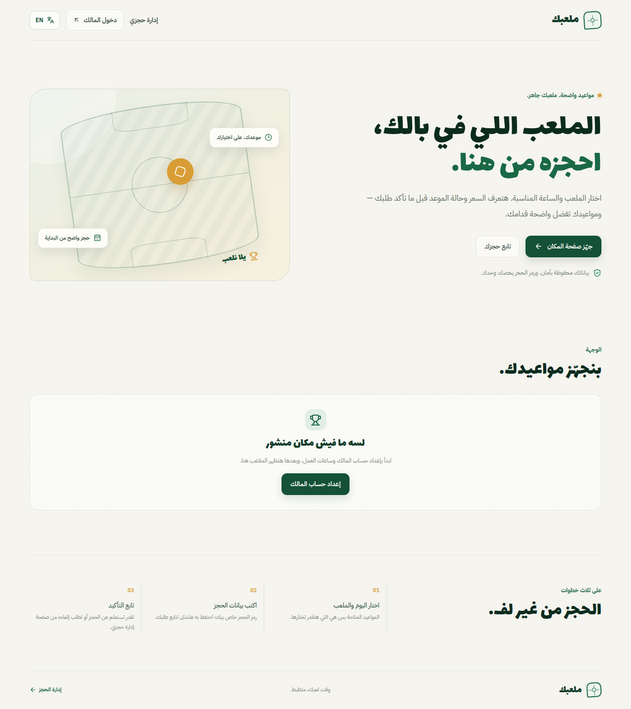
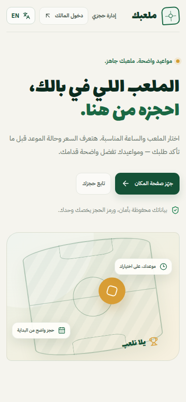
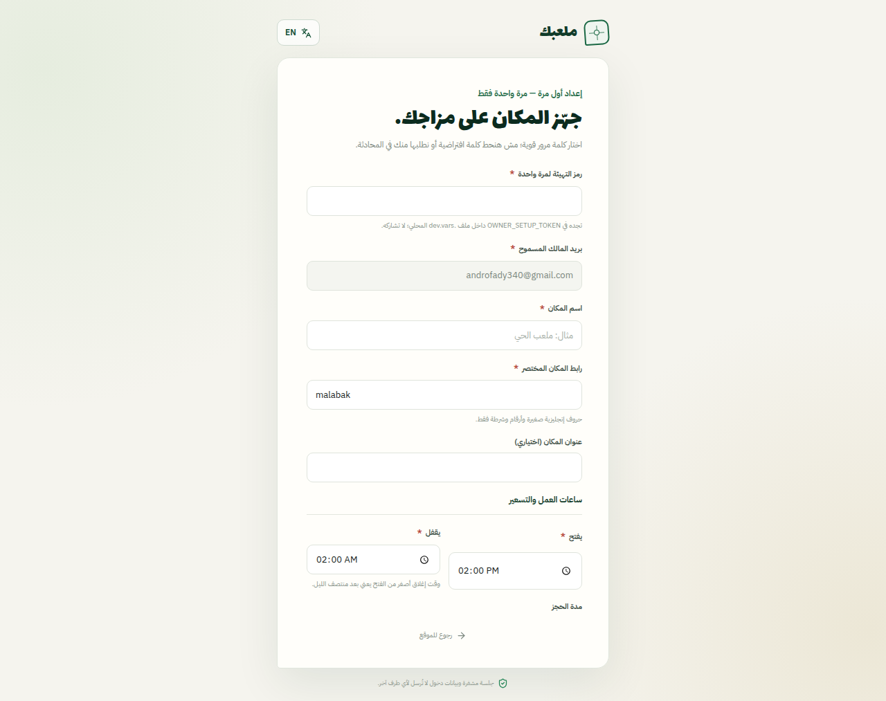
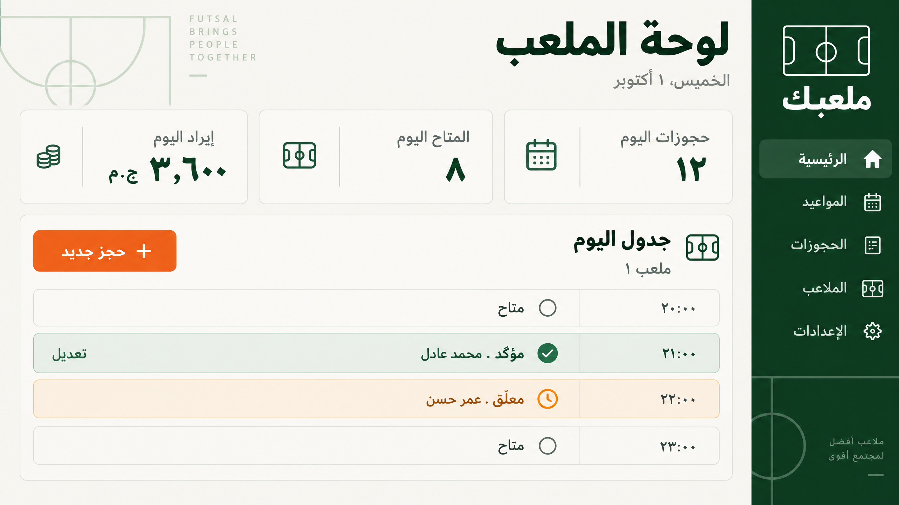
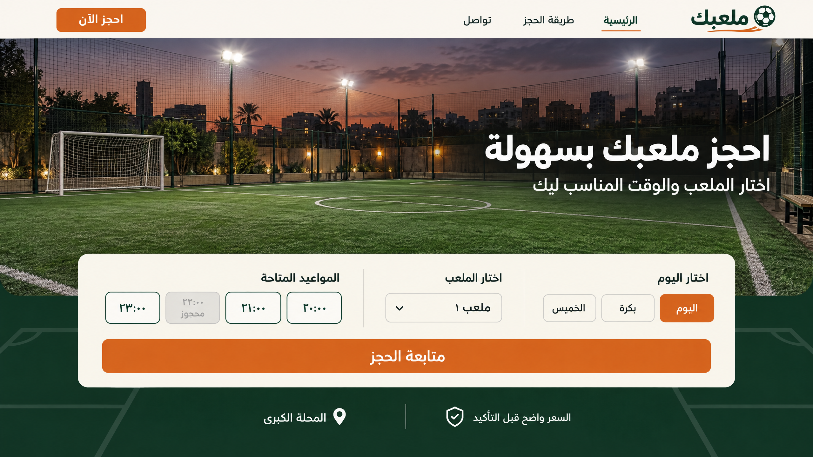

# ملعبك — حجز وإدارة ملاعب خماسية

تطبيق عربي/إنجليزي لحجز ملاعب خماسية وإدارة المواعيد، مبني بـReact وTypeScript وVite وTailwind وtRPC وCloudflare Pages Functions وD1. يبدّل الاتجاه والتنسيق ويحفظ اختيار اللغة على الجهاز. قاعدة البيانات مصدر الحقيقة؛ لا يحتوي هذا المستودع على كلمات مرور فعلية أو بيانات اعتماد.

## ما يعمل في التطبيق

- صفحة عامة لاختيار الملعب واليوم والوقت والسعر الفعلي؛ الفترات المحجوزة/المعلقة ظاهرة لكنها معطّلة ومشطوبة.
- حجز عميل بمهلة مؤقتة ورمز عشوائي يُعرض مرة واحدة؛ متابعة الحالة أو الإلغاء يتطلبان الرمز ورقم الهاتف. البحث الخاص يستخدم POST لا query string.
- لوحة مالك محمية: جدول اليوم، طلبات معلقة، حفظ حالة الدفع، إعادة جدولة ذرية، حجز يدوي ومتكرر، أسعار خاصة حسب أيام/فترات الأسبوع، وإدارة حسابات موظفين بصلاحيات الحجوزات فقط.
- روابط WhatsApp برسائل مناسبة لحالة الطلب؛ طلب الانتظار لا يُرسل بصيغة تأكيد، ويظهر التذكير فقط للحجز المؤكد القادم.
- صور الملاعب فقط: يقبل المتصفح JPEG وPNG وWebP أصلية حتى 10 MiB ويعيد ترميزها إلى WebP منزوعة البيانات الوصفية؛ يتحقق الخادم من بنية WebP وحجمه وأبعاده قبل تخزين حد أقصى 1.5 MB للصورة داخل D1. المعالجة المحلية تتجنب حد CPU البالغ 10ms في Workers Free.
- رفع الصور يتحقق من المالك والملعب وحدود المعدل، ويستبدل الصورة ذريًا مع قيد قاعدة بيانات لصورة نشطة واحدة. لا توجد ميزة لرفع إيصالات الدفع، ولا تُخزن استجابات API في Service Worker.
- حد أقصى طلبان معلّقان للهاتف الواحد مفروض داخل D1، وتحذير للمالك عن مرات الغياب السابقة ومعدل عدم الحضور. إلغاء الحجز يحرر الفترة ويحفظ سجل الحالة.

## صور الواجهة

لقطات المعاينة التالية من التطبيق الجاري محليًا؛ لا تحتوي على حجوزات حقيقية، ولا تنشئ حساب مالك. صورة لوحة الإدارة التالية تصور بصري وليست شاشة دخول فعلية.









الصورة التالية تصور بصري للصفحة الرئيسية أُنشئت قبل ربط حساب Cloudflare:



## متطلبات العمل محليًا

- Node.js 22 وpnpm 11.
- Python 3.11.
- حساب Cloudflare ستربطه أنت عند إعداد D1 أو النشر.

ثبّت الحزم ثم جهّز الأسرار المحلية من غير حفظها في Git:

```bash
pnpm install --frozen-lockfile
cp .dev.vars.example .dev.vars
```

أنشئ **قيمًا مختلفة** للأسرار. مثال لمفتاح تشفير 32 بايت بصيغة Base64 وثلاثة أسرار عشوائية مستقلة:

```bash
openssl rand -base64 32
openssl rand -hex 32
openssl rand -hex 32
openssl rand -hex 32
```

ضع الناتج في `.dev.vars` مقابل `BOOKING_ENCRYPTION_KEY`, `BOOKING_HASH_SECRET`, `AUTH_PEPPER`, و`OWNER_SETUP_TOKEN` على الترتيب. استخدم قيمة قوية مستقلة لرمز التهيئة، ولا تنسخ قيم المثال كما هي. أضف `APP_ORIGINS` بالأصول الدقيقة التي ستستخدمها محليًا/في المعاينة، مثل `http://localhost:3000,http://127.0.0.1:3000`. لا تضف مسارات أو شرطة أخيرة. للمعاينة العامة أو النطاق المنشور أضف أصل HTTPS الخاص بالموقع إلى `APP_ORIGINS` في إعداد البيئة المناسب.

`COOKIE_SECURE=false` في `.dev.vars.example` مخصص للفتح المباشر عبر HTTP على الجهاز المحلي فقط. لأي Preview عام عبر HTTPS أو بيئة منشورة اضبط `COOKIE_SECURE=true`؛ التطبيق يستخدم حينها `Secure; SameSite=None`، ولا يعتمد على كون خادم Pages الداخلي يستقبل HTTP. يجب أن تضيف المتصفحيات المختلفة الكوكيز العابرة للإطار عند استخدام Preview؛ قد تمنعها سياسة third-party cookies لدى المتصفح.

## إعداد Cloudflare Pages وD1 بدون R2

1. قاعدة D1 باسم `malabak` موجودة في حسابك، ومعرّفها مضبوط في `wrangler.toml`. لا تنشئ R2 ولا تفعّل خطة مدفوعة. صور الملاعب فقط تحفظ داخل D1 بحد 1.5 MB للصورة؛ لا يوجد رفع إيصالات.
2. للتجربة المحلية، شغّل:

   ```bash
   pnpm db:migrate:local
   pnpm dev
   ```

   هذا يستخدم D1 محليًا ولا يغيّر قاعدة حسابك. Pages Functions تعمل على `http://localhost:3000`.
3. عند ربط GitHub بـCloudflare Pages، اضبط build command على `pnpm install --frozen-lockfile && pnpm build` ومجلد الإخراج `dist`. اربط D1 بمتغير `DB` وبقاعدة `malabak` ذات المعرّف الموجود في `wrangler.toml`؛ لا تضف R2 binding.
4. بعد التأكد من أن `database_id` هو قاعدة `malabak` الصحيحة، سجّل دخول Wrangler إلى حساب Cloudflare ثم طبّق المخطط مرة واحدة:

   ```bash
   pnpm db:migrate:remote
   ```

   قاعدة حسابك كانت ظاهرة بلا جداول؛ لذلك لا توجد صور أو إيصالات حالية متوقع حذفها. الترحيل `0006` يستبدل جدول الوسائط القديم لإزالة مراجع R2 والإيصالات.
5. أضف الأسرار المذكورة أعلاه إلى إعدادات بيئة Pages (Secrets)، و`OWNER_EMAIL`, `COOKIE_SECURE=true`, و`APP_ORIGINS` كمتغيرات. استخدم أصل الموقع المنشور بدقة، وأنشئ نشرًا جديدًا بعد إضافة الربط والمتغيرات.
6. افتح `/dashboard/setup` مرة واحدة، أدخل `OWNER_SETUP_TOKEN` واختر كلمة المرور بنفسك. البريد المسموح مضبوط على `androfady340@gmail.com`. بعد نجاح الإعداد الأول احذف `OWNER_SETUP_TOKEN` من بيئة التشغيل. من صفحة المكان أضف/عدّل الملعب وساعاته وأسعاره وارفع صورته؛ الملف الوارد حتى 10 MB، والمحفوظ بعد الضغط حتى 1.5 MB.

لا تستخدم `.dev.vars` كإعداد نشر. في Cloudflare أضف المفاتيح وكلمات السر إلى **Secrets** الخاصة بالبيئة. أضف `OWNER_EMAIL` و`COOKIE_SECURE=true` و`APP_ORIGINS` كـ**Variables**؛ اضبط `APP_ORIGINS` على الأصول الفعلية من غير مسار أو شرطة أخيرة. استخدم إعدادًا مختلفًا بين Preview وProduction.

## الاختبار والبناء

```bash
pnpm check:types
pnpm test
pnpm build
```

تغطي الاختبارات قواعد ساعات القاهرة والتوقيت الصيفي وتسعير الحجز، مفاتيح أقفال D1 وتعارضاتها، صحة تواقيع الصور وحدود BLOB، وقيود وترقيات مخطط SQLite. نجاح بناء الواجهة وحده لا يعني أن D1 مربوط؛ اختبر الحساب والرفع في بيئة محلية/Cloudflare مناسبة.

## الترحيلات والنشر عندما تربط حسابك

- راجع الترحيلات قبل كل بيئة؛ ثم بعد ضبط `database_id` طبّقها على قاعدة Cloudflare المربوطة: `pnpm db:migrate:remote`.
- إعداد Pages build: الأمر `pnpm install --frozen-lockfile && pnpm build` ومجلد الإخراج `dist`. احتفظ بمجلد `functions/` مع المستودع حتى تظل Pages Functions فعالة.
- اربط D1 على الاسم `DB` وأضف أسرار البيئة المذكورة أعلاه. لا يحتاج المشروع إلى R2 أو binding للوسائط. خصص أصل HTTPS في `APP_ORIGINS`.
- لا تستخدم `wrangler pages dev --remote` على قاعدة إنتاج لاختبار الرفع. جرّب الحجز والتحرير والتعارض والصورة بإعداد محلي/Preview أولًا.
- لا يوجد دفع أو تكامل بوابة دفع آلي؛ تسجيل حالة «مدفوع» يتم يدويًا بعد تحقق المالك.

## ملاحظات أمنية وتشغيلية

- في حال تعطّل DNS أو قاعدة البيانات، تفشل عملية الحفظ مغلقة ولا تظهر رسالة نجاح كاذبة.
- اختر كلمة مرور لا تقل عن 14 محرفًا و12 محرفًا غير مسافة، واحفظها في مدير كلمات مرور. لا يوجد حساب افتراضي أو مسار استعادة بالبريد مفعّل.
- تغيير إعداد ساعات العمل الذي يتعارض مع حجوزات نشطة يُرفض لحماية بيانات المواعيد؛ أعد الجدولة أو ألغِ الحجوزات المتعارضة أولًا.
- صورة الملعب لا تظهر للعامة إلا عند تفعيل الحجز العام؛ عند إيقافه تحتاج معاينتها إلى جلسة المالك.
- عناوين الترويسات الصارمة، CSRF، تحديد المعدل، عزل المكان، تشفير الهاتف، HMAC ورموز عشوائية للجمهور مفعّلة في طبقة الخادم. اختبارات Sandbox لا تُغني عن فحص إعدادات Cloudflare والحساب قبل الإطلاق.
